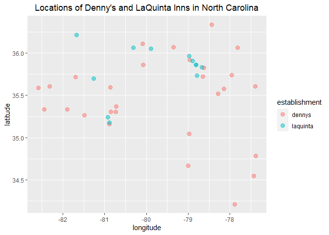
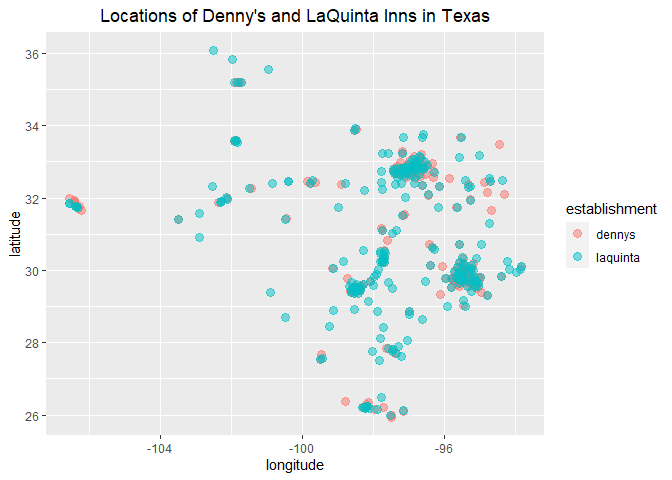

Lab 04 - La Quinta is Spanish for next to Denny’s, Pt. 1
================
Ben Hardin
1/31/2023

### Load packages and data

``` r
library(tidyverse) 
library(dsbox) 
```

``` r
states <- read_csv("data/states.csv")
dennys <- dennys
laquinta <- laquinta
```

### Exercise 1

The Denny’s dataset has 6 columns and 1643 rows. In this datafile, rows
are individual Denny’s. There are 6 variables (columns), representing
each Denny’s address, city, state, zip code, and longitude and latitude
coordinates.

``` r
#getting rows and columns of dennys
nrow(dennys)
```

    ## [1] 1643

``` r
ncol(dennys)
```

    ## [1] 6

``` r
summary(dennys)
```

    ##    address              city              state               zip           
    ##  Length:1643        Length:1643        Length:1643        Length:1643       
    ##  Class :character   Class :character   Class :character   Class :character  
    ##  Mode  :character   Mode  :character   Mode  :character   Mode  :character  
    ##                                                                             
    ##                                                                             
    ##                                                                             
    ##    longitude          latitude    
    ##  Min.   :-158.09   Min.   :19.65  
    ##  1st Qu.:-117.33   1st Qu.:33.00  
    ##  Median : -96.84   Median :36.05  
    ##  Mean   : -99.60   Mean   :36.36  
    ##  3rd Qu.: -82.65   3rd Qu.:40.09  
    ##  Max.   : -68.42   Max.   :64.84

### Exercise 2

The Laquinta dataset has 6 columns and 909 rows. Again, the rows
represent individual LaQuinta Inn locations. The 6 variables are the
same ones we saw in the Denny’s dataset, telling us the location of each
Laquinta location.

``` r
nrow(laquinta)
```

    ## [1] 909

``` r
ncol(laquinta)
```

    ## [1] 6

``` r
summary(laquinta)
```

    ##    address              city              state               zip           
    ##  Length:909         Length:909         Length:909         Length:909        
    ##  Class :character   Class :character   Class :character   Class :character  
    ##  Mode  :character   Mode  :character   Mode  :character   Mode  :character  
    ##                                                                             
    ##                                                                             
    ##                                                                             
    ##    longitude          latitude     
    ##  Min.   :-149.91   Min.   : 6.225  
    ##  1st Qu.:-100.48   1st Qu.:30.475  
    ##  Median : -95.27   Median :34.082  
    ##  Mean   : -94.79   Mean   :35.038  
    ##  3rd Qu.: -84.35   3rd Qu.:39.199  
    ##  Max.   : -70.28   Max.   :64.824

### Exercise 3

From looking at the website, I can see that Denny’s has no locations
outside the US. LaQuinta on the other hand has several locations in
other countries. These include countries like Canada, Chile, China,
Columbia, New Zealand, Turkey, and the UAE.

### Exercise 4

We could also figure out whether these establishments have locations in
other countries using just the datasets we have. Given the information
we have, it seems like some options would be getting either the states
or the zip codes for each location, and filtering for whether the state
or zip code for each location is a place in the US or in a different
country.

### Exercise 5

There are 0 Denny’s locations left after filtering for states that are
not in the US. This confirms what we saw earlier on the website, that
there are no Denny’s outside the US.

``` r
dennys %>%
  filter(!(state %in% states$abbreviation))
```

    ## # A tibble: 0 × 6
    ## # … with 6 variables: address <chr>, city <chr>, state <chr>, zip <chr>,
    ## #   longitude <dbl>, latitude <dbl>

### Exercise 6

The code chunk below makes a new variable for whether each Denny’s is
located in the US or another country. We now have a new dataset with 7
variables, one of which is our new country variable! Confirming our
earlier findings, all 1643 observations in the dataset are Denny’s
located in the US.

``` r
dennys <- dennys %>%
  mutate(country = if_else(state %in% states$abbreviation, "United States", "other"))

#did it work?
summary(dennys)
```

    ##    address              city              state               zip           
    ##  Length:1643        Length:1643        Length:1643        Length:1643       
    ##  Class :character   Class :character   Class :character   Class :character  
    ##  Mode  :character   Mode  :character   Mode  :character   Mode  :character  
    ##                                                                             
    ##                                                                             
    ##                                                                             
    ##    longitude          latitude       country         
    ##  Min.   :-158.09   Min.   :19.65   Length:1643       
    ##  1st Qu.:-117.33   1st Qu.:33.00   Class :character  
    ##  Median : -96.84   Median :36.05   Mode  :character  
    ##  Mean   : -99.60   Mean   :36.36                     
    ##  3rd Qu.: -82.65   3rd Qu.:40.09                     
    ##  Max.   : -68.42   Max.   :64.84

``` r
dennys %>%
  count(country)
```

    ## # A tibble: 1 × 2
    ##   country           n
    ##   <chr>         <int>
    ## 1 United States  1643

### Exercise 7

Running similar code on the La Quinta dataset shows us that there are 14
La Quinta locations outside the US. Now, let’s consult professor google
to figure out which country each of these locations are in, and then
plug those into the code for Ex. 8 to make a country variable.

``` r
laquinta %>%
  filter(!(state %in% states$abbreviation))
```

    ## # A tibble: 14 × 6
    ##    address                                     city  state zip   longi…¹ latit…²
    ##    <chr>                                       <chr> <chr> <chr>   <dbl>   <dbl>
    ##  1 Carretera Panamericana Sur KM 12            "\nA… AG    20345  -102.    21.8 
    ##  2 Av. Tulum Mza. 14 S.M. 4 Lote 2             "\nC… QR    77500   -86.8   21.2 
    ##  3 Ejercito Nacional 8211                      "Col… CH    32528  -106.    31.7 
    ##  4 Blvd. Aeropuerto 4001                       "Par… NL    66600  -100.    25.8 
    ##  5 Carrera 38 # 26-13 Avenida las Palmas con … "\nM… ANT   0500…   -75.6    6.22
    ##  6 AV. PINO SUAREZ No. 1001                    "Col… NL    64000  -100.    25.7 
    ##  7 Av. Fidel Velazquez #3000 Col. Central      "\nM… NL    64190  -100.    25.7 
    ##  8 63 King Street East                         "\nO… ON    L1H1…   -78.9   43.9 
    ##  9 Calle Las Torres-1 Colonia Reforma          "\nP… VE    93210   -97.4   20.6 
    ## 10 Blvd. Audi N. 3 Ciudad Modelo               "\nS… PU    75010   -97.8   19.2 
    ## 11 Ave. Zeta del Cochero No 407                "Col… PU    72810   -98.2   19.0 
    ## 12 Av. Benito Juarez 1230 B (Carretera 57) Co… "\nS… SL    78399  -101.    22.1 
    ## 13 Blvd. Fuerza Armadas                        "con… FM    11101   -87.2   14.1 
    ## 14 8640 Alexandra Rd                           "\nR… BC    V6X1…  -123.    49.2 
    ## # … with abbreviated variable names ¹​longitude, ²​latitude

### Exercise 8

Great, now we have a country variable! We can see that, in this dataset,
there are 10 La Quintas in Mexico, 2 in Canada, 1 in Honduras, and 1 in
Columbia

``` r
laquinta <- laquinta %>%
  mutate(country = case_when(
    state %in% states$abbreviation  ~ "United States",
    state %in% c("ON", "BC")  ~ "Canada",
    state %in% c("AG", "QR", "CH", "NL", "VE", "PU", "SL")  ~ "Mexico",
    state == "ANT"  ~ "Colombia",
    state == "FM"  ~ "Honduras"
  ))

#did it work?
summary(laquinta)
```

    ##    address              city              state               zip           
    ##  Length:909         Length:909         Length:909         Length:909        
    ##  Class :character   Class :character   Class :character   Class :character  
    ##  Mode  :character   Mode  :character   Mode  :character   Mode  :character  
    ##                                                                             
    ##                                                                             
    ##                                                                             
    ##    longitude          latitude        country         
    ##  Min.   :-149.91   Min.   : 6.225   Length:909        
    ##  1st Qu.:-100.48   1st Qu.:30.475   Class :character  
    ##  Median : -95.27   Median :34.082   Mode  :character  
    ##  Mean   : -94.79   Mean   :35.038                     
    ##  3rd Qu.: -84.35   3rd Qu.:39.199                     
    ##  Max.   : -70.28   Max.   :64.824

``` r
laquinta %>%
  count(country)
```

    ## # A tibble: 5 × 2
    ##   country           n
    ##   <chr>         <int>
    ## 1 Canada            2
    ## 2 Colombia          1
    ## 3 Honduras          1
    ## 4 Mexico           10
    ## 5 United States   895

### Exercise 9

Both Denny’s and LaQuinta have a majority of their locations in
California, Texas, and Florida. This isn’t very surprising because these
are 3 highly populated states. I also learned from professor google that
the high concentration of locations in CA and TX can also be explained
by the fact that Denny’s and LaQuinta were founded in California and
Texas, respectively.

``` r
dennys %>%
  count(state) %>%
  arrange(desc(n))
```

    ## # A tibble: 51 × 2
    ##    state     n
    ##    <chr> <int>
    ##  1 CA      403
    ##  2 TX      200
    ##  3 FL      140
    ##  4 AZ       83
    ##  5 IL       56
    ##  6 NY       56
    ##  7 WA       49
    ##  8 OH       44
    ##  9 MO       42
    ## 10 PA       40
    ## # … with 41 more rows

``` r
laquinta %>%
  filter(country == "United States") %>%
  count(state) %>%
  arrange(desc(n))
```

    ## # A tibble: 48 × 2
    ##    state     n
    ##    <chr> <int>
    ##  1 TX      237
    ##  2 FL       74
    ##  3 CA       56
    ##  4 GA       41
    ##  5 TN       30
    ##  6 OK       29
    ##  7 LA       28
    ##  8 CO       27
    ##  9 NM       19
    ## 10 NY       19
    ## # … with 38 more rows

### Exercise 10

Both Denny’s and La Quinta have a large number of locations per square
mile both in states where they have a lot of locations in general, like
California, Texas, and Florida, as well as geographically small states
like Rhode Island, Connecticut, and Maryland.

``` r
#dennys locations by square miles
dennys %>%
  count(state) %>%
  inner_join(states, by = c("state" = "abbreviation")) %>%
  mutate(locations_per_sqm = (n/area)) %>%
  arrange(desc(locations_per_sqm))
```

    ## # A tibble: 51 × 5
    ##    state     n name                     area locations_per_sqm
    ##    <chr> <int> <chr>                   <dbl>             <dbl>
    ##  1 DC        2 District of Columbia     68.3          0.0293  
    ##  2 RI        5 Rhode Island           1545.           0.00324 
    ##  3 CA      403 California           163695.           0.00246 
    ##  4 CT       12 Connecticut            5543.           0.00216 
    ##  5 FL      140 Florida               65758.           0.00213 
    ##  6 MD       26 Maryland              12406.           0.00210 
    ##  7 NJ       10 New Jersey             8723.           0.00115 
    ##  8 NY       56 New York              54555.           0.00103 
    ##  9 IN       37 Indiana               36420.           0.00102 
    ## 10 OH       44 Ohio                  44826.           0.000982
    ## # … with 41 more rows

``` r
#laquinta locations by square miles
laquinta %>%
  filter(country == "United States") %>%
  count(state) %>%
  inner_join(states, by = c("state" = "abbreviation")) %>%
  mutate(locations_per_sqm = (n/area)) %>%
  arrange(desc(locations_per_sqm))
```

    ## # A tibble: 48 × 5
    ##    state     n name             area locations_per_sqm
    ##    <chr> <int> <chr>           <dbl>             <dbl>
    ##  1 RI        2 Rhode Island    1545.          0.00129 
    ##  2 FL       74 Florida        65758.          0.00113 
    ##  3 CT        6 Connecticut     5543.          0.00108 
    ##  4 MD       13 Maryland       12406.          0.00105 
    ##  5 TX      237 Texas         268596.          0.000882
    ##  6 TN       30 Tennessee      42144.          0.000712
    ##  7 GA       41 Georgia        59425.          0.000690
    ##  8 NJ        5 New Jersey      8723.          0.000573
    ##  9 MA        6 Massachusetts  10554.          0.000568
    ## 10 LA       28 Louisiana      52378.          0.000535
    ## # … with 38 more rows

Now let’s visualize the relationship between Denny’s and La Quinta for
the whole United States. Neat!

``` r
#combining dennys and laquinta datasets
dennys <- dennys %>%
  mutate(establishment = "dennys")

laquinta <- laquinta %>%
  mutate(establishment = "laquinta")

dn_lq <- bind_rows(dennys, laquinta)

#visualizing relationship between dennys and laquinta
ggplot(dn_lq %>%
         filter(country == "United States"), mapping = aes(x = longitude,
                            y = latitude,
                            color = establishment))+
  geom_point()
```

<!-- --> \### Exercise 11

``` r
ggplot(dn_lq %>%
         filter(state == "NC"), mapping = aes(x = longitude,
                            y = latitude,
                            color = establishment))+
  geom_point(size = 3, alpha = 0.5)
```

<!-- -->

### Exercise 12

``` r
ggplot(dn_lq %>%
         filter(state == "TX"), mapping = aes(x = longitude,
                            y = latitude,
                            color = establishment))+
  geom_point(size = 3, alpha = 0.5)
```

<!-- -->
